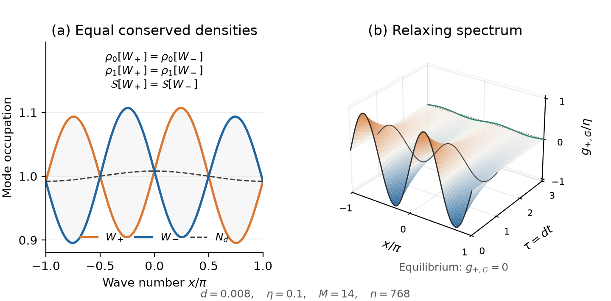

# Collision invariants and long-lived spectral memory in a pinned chain

**Dongzhe Zheng · Princeton University**

This repository contains a standalone Lean 4 proof of the one-dimensional collision-invariant conjecture posed by Aoki, Lukkarinen and Spohn in [2006](https://doi.org/10.1007/s10955-006-9171-2), together with numerical experiments on slow relaxation in the narrow-band limit.

For the pinned dispersion

$$
\omega_d(x)=\sqrt{1-2d\cos x},\qquad 0<d<\tfrac12,
$$

the complete measurable classification is

$$
\phi(x)=A+B\omega_d(x)\quad\text{for Haar-almost every }x.
$$

The hypothesis is the four-wave collision identity almost everywhere under the original regular resonance coarea measure. No additional smoothness or integrability assumption is imposed. The proof also establishes uniqueness, a unique smooth periodic representative, the real-valued classification and the converse identity on every resonant quartet.

The full classification has been checked end to end in Lean, with **no `sorry`, `admit` or custom axioms**. Its only axioms are the standard Lean/Mathlib foundations `propext`, `Classical.choice` and `Quot.sound`. The recorded build, theorem-type checks and axiom audits correspond to the frozen source distributed here.

## Spectral memory beyond the two conserved densities

Although only wave action and energy are exactly conserved by collisions, narrow-band scattering can retain additional information for a long time. The numerical experiments follow low Rayleigh–Ritz rates, the correlation of a `sin(2x)` preparation, its quadratic entropy deficit and the full linear occupation spectrum. Quadrature uses the exact nontrivial resonance branch, followed by a finite Galerkin projection.



The two preparations have equal action, energy and initial wave entropy. Their subsequent spectral difference illustrates the distinction between equilibrium parameters and information needed to describe relaxation at finite times. The numerical rates and curves are finite-dimensional evidence; they do not establish a matching asymptotic or a lower bound for the full collision spectral gap.

## Repository layout

| Path | Contents |
| --- | --- |
| `formal/` | 21 Lean modules and 232 explicit theorems, with pinned Lean and Mathlib dependencies |
| `formal/verification/` | Source manifests, extraction provenance, server build logs, theorem-type checks and axiom audits |
| `numerics/` | Narrow-band programs, locked Python dependencies, baseline data and provenance |
| `scripts/` | Numerical reproduction, comparison, plotting, integrity checks and packaging |
| `figures/` | Five figures in PDF and PNG formats |
| `docs/` | Numerical definitions and reproduction instructions |

The Lean development covers the complete collision-invariant classification and its proof dependencies. Spectral-gap and narrow-band lifetime results in the accompanying manuscript are outside the formalized theorem set.

## Check the source and recorded evidence

Run from the repository root:

```sh
python3 formal/scripts/verify.py --source-only
python3 scripts/check_repository.py
```

These Python checks validate source hashes, inventories, data provenance and the correspondence with the recorded server evidence. They do not execute Lean. The successful server result is available in [formal/verification/server/result.json](formal/verification/server/result.json); the theorem entry points and verification method are described in [formal/README.md](formal/README.md) and [formal/docs/VERIFICATION.md](formal/docs/VERIFICATION.md).

## Reproduce the numerical experiments

```sh
python3 -m venv .venv
.venv/bin/python -m pip install -r numerics/requirements.txt
OPENBLAS_NUM_THREADS=1 .venv/bin/python scripts/run_numerics.py
.venv/bin/python scripts/check_numerics.py
```

Outputs go to the ignored `generated/` directory, leaving the tracked baseline data intact. A complete rerun reproduced the baseline CSV values and physical spectrum arrays exactly in the recorded environment; all five PNG figures also matched byte for byte. See [docs/numerics.md](docs/numerics.md) for configurations, definitions and comparison tolerances, and [numerics/verification/regression.json](numerics/verification/regression.json) for the recorded comparison.

## Reproduce the formal verification on a server

On a Linux server with Lean/Lake configured:

```sh
cd formal
PINNED_LEAN_SERVER=1 sh scripts/server-verify.sh
```

If the locked Mathlib dependencies are already installed, set `PINNED_LEAN_PACKAGES=/absolute/path/to/.lake/packages`. The script builds the project in a new directory and records source hashes, all listed theorem types, the transitive proof dependencies and the axioms of the five main theorems. An additional `--fresh` kernel replay is optional; the distributed successful verification record does not claim that this optional replay was run.

## Provenance and scope

The proof was extracted from the authors' [veridiscoverLab/resonance-kinetic-lean](https://github.com/veridiscoverLab/resonance-kinetic-lean) repository at commit `7afa3fa2d2c3c46023cd863ab26ac32352995578`. All 20 classification modules are retained byte for byte; the shared `Collision.lean` module retains only the original dispersion definition needed by this proof. This repository has its own Git history and contains no unrelated models or upstream build caches.

The authors' associated manuscripts have not yet been released as preprints or submitted. Attribution files are retained with the formal sources. The upstream project has no selected open-source license, and this packaging does not add a new license grant.

## Portable source archive and Git bundle

From a clean, committed checkout:

```sh
python3 scripts/package_repository.py
```

The ignored `dist/` directory receives `pinned-collision-invariants.tar.gz`, a per-file SHA-256 manifest and `pinned-collision-invariants.bundle`. The source archive contains only tracked files, without `.git`, dependency sources, environments or build caches. The Git bundle retains this repository's standalone history:

```sh
git clone pinned-collision-invariants.bundle pinned-collision-invariants
cd pinned-collision-invariants
python3 scripts/check_repository.py
```

The extracted source archive supports the same numerical and server reproduction commands. To package it again, first initialize Git and commit its files.
